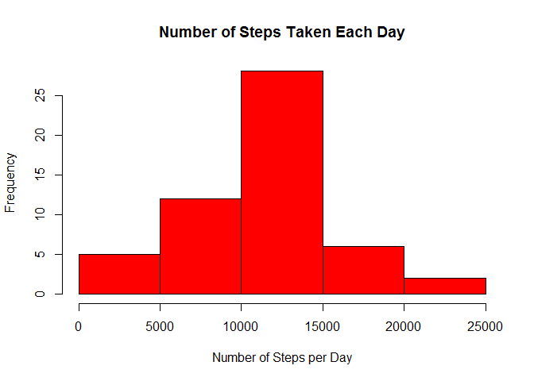
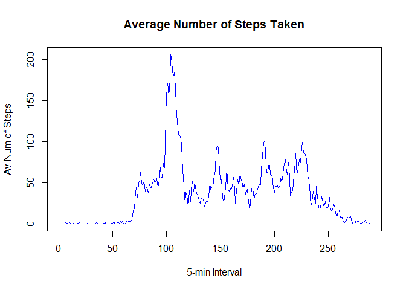
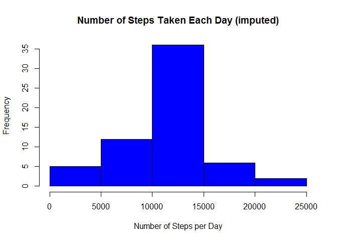

# Reproducible Research: Peer Assessment 1
Nazmi Anik  


## Loading and preprocessing the data  

###1. Unzip the file first, if the unzipped file is not already in the working directory.  

```r
if(!file.exists('activity.csv')){
    unzip('activity.zip')
}
```

###2. Load the data ( i.e. read.csv() )  

```r
#read the table
activity <- read.csv("activity.csv", stringsAsFactors=FALSE, na.strings="NA")
```

###3. Process/transform the data (if necessary) into a format suitable for your analysis  

```r
#change the date column's class from string to Date
activity[,"date"] <- as.Date(activity[,"date"],format='%Y-%m-%d')
#display the first few rows
head(activity)
```

```
##   steps       date interval
## 1    NA 2012-10-01        0
## 2    NA 2012-10-01        5
## 3    NA 2012-10-01       10
## 4    NA 2012-10-01       15
## 5    NA 2012-10-01       20
## 6    NA 2012-10-01       25
```

## What is mean total number of steps taken per day?  

###1. Calculate the total number of steps taken per day  

```r
#import dplyr library
library(dplyr)
```

```r
#group the activity table by day
activityDay <- group_by(activity, date)
#summarize this grouped table with the sum of steps for each day
stepDay <- summarize(activityDay, steps_by_day = sum(steps))
#For this part of the assignment, you can ignore the missing values in the dataset.
stepDay <- na.omit(stepDay)
#display the first few rows
head(stepDay)
```

```
## Source: local data frame [6 x 2]
## 
##         date steps_by_day
## 1 2012-10-02          126
## 2 2012-10-03        11352
## 3 2012-10-04        12116
## 4 2012-10-05        13294
## 5 2012-10-06        15420
## 6 2012-10-07        11015
```

###2. Make a histogram of the total number of steps taken each day  

```r
#create the histogram
hist(stepDay$steps_by_day, main="Number of Steps Taken Each Day", xlab="Number of Steps per Day", ylab="Frequency", col = "red")
```

 

###3. Calculate and report the mean and median of the total number of steps taken per day

```r
#take the mean and median from the summed column
stepDayMean <- mean(stepDay$steps_by_day)
stepDayMean
```

```
## [1] 10766.19
```

```r
stepDayMedian <- median(stepDay$steps_by_day)
stepDayMedian
```

```
## [1] 10765
```
The mean total number of steps taken per day: 10766.1886792453  
The median total number of steps taken per day: 10765   

## What is the average daily activity pattern?  

###1. Make a time series plot (i.e. type = "l") of the 5-minute interval (x-axis) and the average number of steps taken, averaged across all days (y-axis)  

```r
#average number of steps taken (mean) within each interval
stepInterval <- aggregate(list(stepMean=activity$steps), list(interval=activity$interval), mean, na.rm=TRUE)
#plot the line plot
plot(stepInterval, type="l", xlab="5-min Interval", ylab="Av Num of Steps", main = "Average Number of Steps Taken", col = "blue")
```

 

###2. Which 5-minute interval, on average across all the days in the dataset, contains the maximum number of steps?  

```r
#sort the data frame
stepIntervalOrdered <- arrange(stepInterval, desc(stepMean))
#top of the data frame has the max number of steps
stepIntervalOrdered[1,]
```

```
##   interval stepMean
## 1      835 206.1698
```
The maximum number of steps (on average 206.1698) is on Interval 835.  

## Imputing missing values  

###1. Calculate and report the total number of missing values in the dataset (i.e. the total number of rows with NAs)  

```r
#for each column, take sum of is.na()
numNA <- sapply(activity, function(x) sum(is.na(x)))
#first columns sum is the number of missing values in the dataset
numNA[[1]]
```

```
## [1] 2304
```
Source for the code is [here](http://stackoverflow.com/questions/8317231/elegant-way-to-report-missing-values-in-a-data-frame)  
Total number of rows with NA: 2304  

###2. Devise a strategy for filling in all of the missing values in the dataset. The strategy does not need to be sophisticated. For example, you could use the mean/median for that day, or the mean for that 5-minute interval, etc.  

Strategy is to identify where the na values are, and then replace them with the corresponding interval's mean value.
Those mean values were already stored in the *stepInterval* table.  

We will need to do a for loop to traverse the original *activity* table. Each time a missing value is encountered, the 
corresponding mean step value will need to be identified.  

The missing values are then replaced with mean step value for that corresponding 5-minute interval.  

###3. Create a new dataset that is equal to the original dataset but with the missing data filled in.  

```r
#create new data frame
activityImputed <- activity
#loop in the original data frame
for (i in 1:nrow(activity)){
    #when na value is encountered
    if (is.na(activity$steps[i])){
        #store the interval where na value was encountered
        intervalNum <- activity$interval[i]
        #store the row number that corresponds to that interval in the data frame with mean of steps per interval
        rowNum <- which(stepInterval$interval == intervalNum)
        #get the mean step value over the interval we encountered the na
        stepMean <- stepInterval$stepMean[rowNum]
        #replace the na with that mean step value
        activityImputed$steps[i] <- stepMean
        }
    }
#compare
head(activity)
```

```
##   steps       date interval
## 1    NA 2012-10-01        0
## 2    NA 2012-10-01        5
## 3    NA 2012-10-01       10
## 4    NA 2012-10-01       15
## 5    NA 2012-10-01       20
## 6    NA 2012-10-01       25
```

```r
head(activityImputed)
```

```
##       steps       date interval
## 1 1.7169811 2012-10-01        0
## 2 0.3396226 2012-10-01        5
## 3 0.1320755 2012-10-01       10
## 4 0.1509434 2012-10-01       15
## 5 0.0754717 2012-10-01       20
## 6 2.0943396 2012-10-01       25
```

###4. Make a histogram of the total number of steps taken each day and Calculate and report the mean and median total number of steps taken per day. Do these values differ from the estimates from the first part of the assignment? What is the impact of imputing missing data on the estimates of the total daily number of steps?  

```r
#group the activity table by day
activityDayI <- group_by(activityImputed, date)
#summarize this grouped table with the sum of steps for each day
stepDayI <- summarize(activityDayI, steps_by_day = sum(steps))
#create the histogram
hist(stepDayI$steps_by_day, main="Number of Steps Taken Each Day (imputed)", xlab="Number of Steps per Day", ylab="Frequency", col = "blue")
```

 

```r
stepDayMeanI <- mean(stepDayI$steps_by_day)
stepDayMeanI
```

```
## [1] 10766.19
```

```r
stepDayMedianI <- median(stepDayI$steps_by_day)
stepDayMedianI
```

```
## [1] 10766.19
```
The mean value stayed the same as expected, since we used the mean values to fill in missing data.  
The median value changed slightly from the original. It now equals the mean value.  

## Are there differences in activity patterns between weekdays and weekends?  
